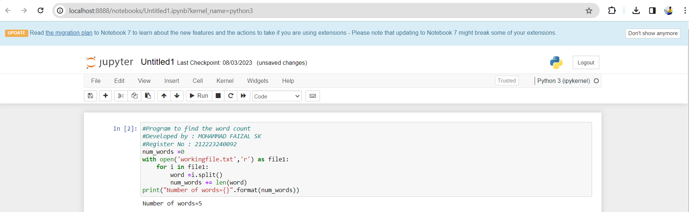

# Word-count
## AIM:
To write a python program for getting the word count from a text.
## EQUIPEMENT'S REQUIRED: 
PC
Anaconda - Python 3.7
## ALGORITHM: 
### Step 1:
Decleare number of words is 0.
### Step 2:
open it with txt file.
### Step 3:
Give range for i.
### Step 4:
Then next split the words.
### Step 5:
Count the number of words.
### Step 6:
Giving print statement for getting output.

## PROGRAM:
```py
#Program to find the word count
#Developed by : MOHAMMAD FAIZAL SK
#Register No : 212223240092
num_words =0
with open('workingfile.txt','r') as file1:
    for i in file1:
        word =i.split()
        num_words += len(word)
print("Number of words={}".format(num_words)) 
```

### OUTPUT:


## RESULT:
Thus the program is written to find the word count from a text.
